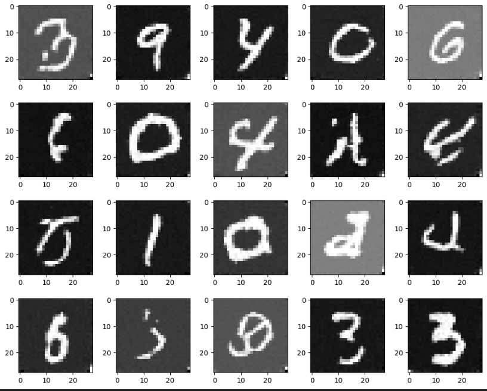

# Diffusion Model on MNIST Dataset

Implementation of a diffusion generative model as detailed in [Denoising Diffusion Probalistic Models](https://arxiv.org/pdf/2006.11239).

## Generated Samples

## Files

- `assets/` contains the above picture
- `data/` contains the MNIST data set
- `models/` currently empty, but will contain the trained models
- `src/` source files
- `theory/` contains a write-up of the mathematical derivation for this model

## Authors

Akash Piya
